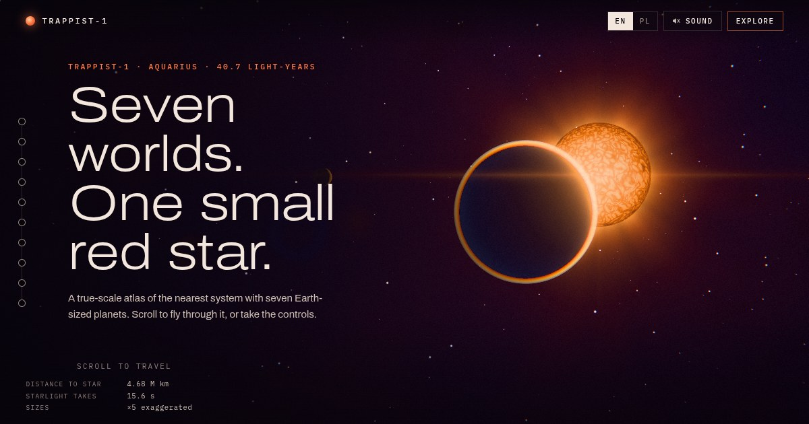

# TRAPPIST-1 Atlas

**Seven worlds. One small red star.**
A scroll-driven, true-scale 3D atlas of the TRAPPIST-1 system, 40.7 light-years away. Every planet is generated in the browser by shaders, and the soundtrack is the system's real orbital resonance.

*Po polsku: interaktywny atlas 3D układu TRAPPIST-1 w prawdziwej skali. Wszystkie powierzchnie i dźwięki powstają w przeglądarce; strona ma wersję PL/EN.*



## What is in it

- **A flight through the system.** Scroll to travel from the star past all seven worlds (b to h), out to the resonant chain, then to true scale, where the whole system shrinks to a speck inside Mercury's orbit.
- **Seven procedural worlds.** Craters, ocean and clouds, cracked ice, tholin-stained rock. Single-scattering atmospheres, a granulated star with flares, dual-filter bloom and a lens flare. No textures, no models.
- **Explore mode.** Orbit and zoom, click a world, speed up time, switch between exaggerated and true scale, watch the resonance clock.
- **Sky from the surface.** Stand on any planet and look up. Neighbouring worlds and the star appear at their real angular size, and you can zoom until another world shows a phase.
- **Sound, opt-in.** Orbital frequency scales as 1 / period. The near-exact period ratios (8:5, 5:3, 3:2, 3:2, 4:3, 3:2) make the seven frequencies a just-intonation chord: 55, 82.5, 110, 165, 247.5, 412.5 and 660 Hz. Every transit, when a world crosses the line of sight to Earth, plucks its note.
- **Data.** Values from Agol et al. 2021 as listed by the NASA Exoplanet Archive, in a semantic table and two single-series charts.
- **English and Polish**, chosen from the browser language.

Surfaces are artist's impressions. Nothing about these planets' surfaces has been imaged; the page says so.

## Run it

```bash
npm install
npm run dev       # http://127.0.0.1:5173
npm run build     # static site in dist/
npm run preview
```

Node 20 or newer. WebGL2 is required for the 3D view; without it the page falls back to a readable text version with the full data table.

### Controls

| | |
|---|---|
| Scroll / PageDown | Fly through the story |
| Explore | Drag to orbit, wheel or pinch to zoom, click a world |
| Space, `[` `]` | Pause, slower, faster |
| `1`–`7`, `0`, `Home` | Focus b–h, the star, the overview |
| `T` `O` `L` `C` | True scale, orbits, labels, clock |
| `S` | Sky from the surface of the focused world |
| `M`, `Esc` | Sound, back |

## How it is built

```
src/
  data.js          physical data, derived values, the resonance chord
  content.js       all copy, EN and PL
  story.js         scroll coordinate, camera rigs, panel timing
  explore.js       orbit camera, time, labels, sky-from-surface mode
  audio.js         WebAudio score (drone, plucks, reverb from a generated impulse)
  ui.js            panels, rail, data table and SVG charts
  gl/
    system.js      scene: star, planets, orbits, markers, dynamic near/far
    planets.js     per-world surface shaders, clouds, ray-marched atmospheres
    star.js        convection surface, corona, flares and prominences
    sky.js         stars, nebula, dust
    horizon.js     screen-space ground and haze for the surface view
    post.js        MSAA half-float target, bloom, lens flare, tone map, grade
    engine.js      renderer, quality tiers and a frame-time governor
```

Scale is real: one scene unit is one Earth radius. Planets and the star are drawn larger in most views so they can be seen, and the HUD says by how much.

Performance: quality adapts on its own (resolution scale first, then tier). Add `?q=0`, `?q=1` or `?q=2` to force low, medium or high.

### Tools

```bash
npm run artifact                       # one-file build in .artifact/ (inline JS and CSS)
node scripts/smoke.mjs                 # drives the main flows in headless Chromium
node scripts/a11y-test.mjs             # no-WebGL fallback, reduced motion, keyboard
node scripts/story-shots.mjs <dir> '[0.36, 5.3]'   # screenshots at story coordinates
```

The scripts expect the dev server on port 5173 and Chromium at `CHROME_BIN` (default: the Playwright build).

### Deploy

The included workflow (`.github/workflows/pages.yml`) publishes `dist/` to GitHub Pages on every push to `main`. Enable Pages with the source set to GitHub Actions. Any static host works, since asset paths are relative. For social previews, point `og:image` in `index.html` at an absolute URL.

## Sources

- Gillon et al. 2017, *Nature* 542, 456. doi:10.1038/nature21360
- Agol et al. 2021, *Planetary Science Journal* 2, 1. doi:10.3847/PSJ/abd022
- Greene et al. 2023 and Zieba et al. 2023, *Nature*: JWST day-side measurements of b and c
- NASA Exoplanet Archive, TRAPPIST-1 overview
